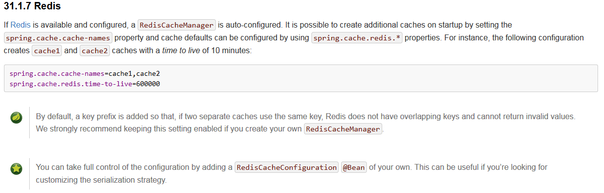

# <center>spring boot 2.0 学习笔记</center>

## 1. 在spring boot中开启redis缓存并自定义配置的注意事项

* 官方文档如下
  
* RedisCacheConfiguration 的API截图
  

* 代码示例如下

  ```java
  @Component
  @EnableCaching
  public class RedisConfig extends CachingConfigurerSupport {

      @Bean
      public RedisCacheConfiguration redisCacheConfiguration() {
          GenericJackson2JsonRedisSerializer genericJackson2JsonRedisSerializer
                  = new GenericJackson2JsonRedisSerializer();
          RedisCacheConfiguration configuration = RedisCacheConfiguration
                  .defaultCacheConfig();
          configuration = configuration.serializeValuesWith
                  (RedisSerializationContext.SerializationPair.fromSerializer
                          (genericJackson2JsonRedisSerializer)).entryTtl(Duration.ofDays
                  (30));
          return configuration;
      }
  }
  ```

* 测试结果如下
  

以上配置将不会显示为二进制value

* [【spring boot】2.0 配置@cacheable 自定义序列化方式 缓存数据到redis](http://ju.outofmemory.cn/entry/349835)